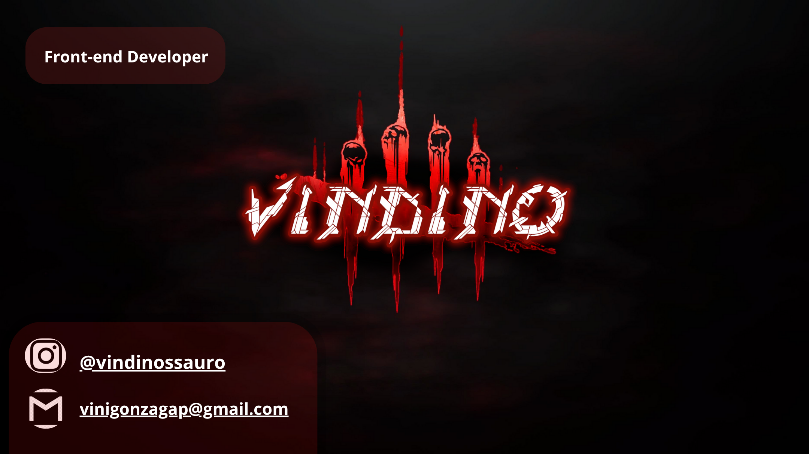

<!-- Banner central -->

  

<h1 align="center">
 
</h1>

  <strong>Desenvolvedor • Estudante de Tecnologia • Amante de Ciência e RPG</strong>

<!-- SEPARADOR PERSONALIZADO -->

  

<!-- SOBRE MIM -->
##  Sobre mim
- Focado em **desenvolvimento backend e web**
- Criador do RPG inspirado em **ARK** (genética, criaturas e sistemas)
- Sempre estudando **Java, Web, banco de dados e lógica avançada**
- Gosto de estruturar sistemas, regras e mundos funcionais

<!-- SEPARADOR RUNAS -->

  ✦ ✦ ✦

##  Tecnologias que uso

### **Linguagens**

  

### **IDE / Ferramentas**

  

##  Minhas redes

  
  
  
  

<!-- SEPARADOR RED LINE -->

  

##  Estatísticas do GitHub

  
  

<!-- SEPARADOR COM ÍCONE -->

  

##  Conquistas & Atividade

<picture>
<!-- Usa a versão DARK (com o vermelho escuro) no modo escuro -->
<source media="(prefers-color-scheme: dark)" srcset="https://raw.githubusercontent.com/viniciugonzaga/viniciugonzaga/output/github-contribution-grid-snake-dark.svg">
<!-- Versão padrão (light) -->

</picture>

<!-- SEPARADOR SUTIL -->

  ✧ ───── • ✧ • ───── ✧

  

<!-- FINAL -->

  <strong style="color:#b30000;">Obrigado por visitar! </strong>

  

